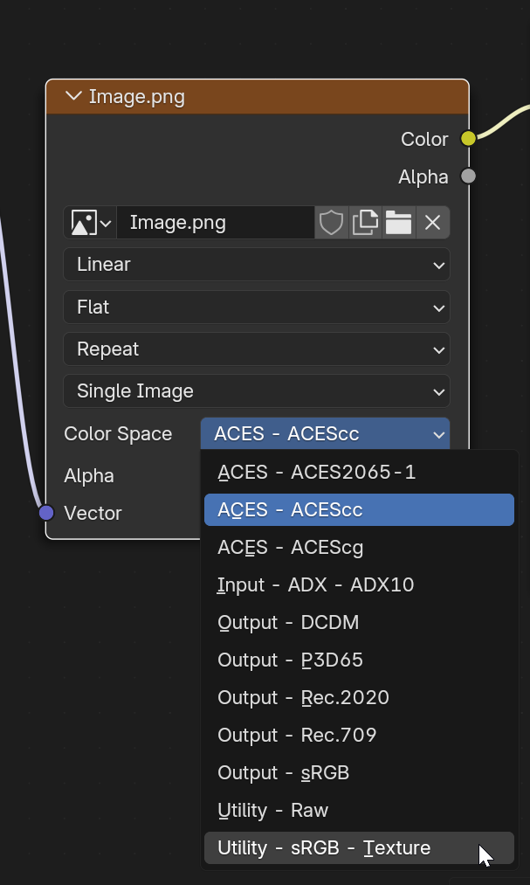

# Optimized ACES 1.2 OCIO Configuration

A streamlined OpenColorIO configuration implementing ACES 1.2, optimized for production while maintaining compliance.

## Color Spaces

- **ACES Core**: ACES2065-1, ACEScc, ACEScg
- **Input**: ADX10  
- **Output**: DCDM, P3D65, Rec.2020, Rec.709, sRGB
- **Utility**: Raw, sRGB-Texture

## Installation

1. Navigate to your ACES 1.2 configuration directory
2. Backup the original config file:
```bash
mv config.ocio config.ocio.backup
```
3. Copy this optimized config file to replace the original:
```bash
cp /path/to/optimized/config.ocio config.ocio
```
4. Add required ACES 1.2 LUTs to the `luts` directory
5. Set environment variable:
```bash
export OCIO=/path/to/config.ocio
```

## Required LUTs
Place in `luts` directory:
- ACEScc_to_linear.spi1d
- ADX_CID_to_RLE.spi1d
- Log2_48_nits_Shaper_to_linear.spi1d
- ACES RRT/ODT transform LUTs

## Software Requirements
- OpenColorIO 2.0+
- Compatible with: Nuke, Maya, Houdini, Resolve, Flame

## Role Configuration
```yaml
roles:
  color_picking: Output - sRGB
  color_timing: ACES - ACEScc
  compositing_linear: ACES - ACEScg
  compositing_log: Input - ADX - ADX10
  data: Utility - Raw
  default: ACES - ACES2065-1
  matte_paint: Utility - sRGB - Texture
  reference: Utility - Raw
  rendering: ACES - ACEScg
  scene_linear: ACES - ACEScg
  texture_paint: ACES - ACEScc
```
